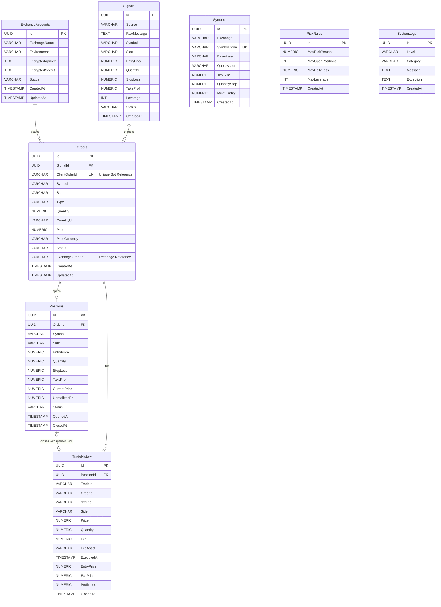

# Entity Relationship Diagram (ERD) Specification

This document presents the **Entity-Relationship Diagram (ERD)** for the **Telegram Signal Trading Bot**, detailing table structures, relationships, cardinalities, and foreign key constraint rules.

---

## 1. Visual Entity Relationship Diagram (Mermaid)

The following diagram defines the relational connections and cardinalities between the persistence tables.

---

## 2. Relationship Explanations & Referential Integrity

This database design guarantees absolute referential integrity to prevent corrupted states or orphaned transactions, which is critical for an enterprise-grade financial trading engine.

### 2.1 relationship: `ExchangeAccount 1:N Orders`
*   **Relationship Type:** One-to-Many (`1:N`).
*   **Cardinality Details:** An exchange account can exist without placed orders (zero orders), but any placed order is bound to exactly one `ExchangeAccount`.
*   **Foreign Key Constraint:** `Orders(ExchangeAccountId) REFERENCES ExchangeAccounts(Id) ON DELETE RESTRICT`.
*   **Integrity Rule:** Accounts cannot be deleted if there are existing orders. This maintains historical execution logs.

### 2.2 relationship: `Signals 1:1 Orders`
*   **Relationship Type:** One-to-One (`1:1`).
*   **Cardinality Details:** A signal triggers at most one order (one-to-one or zero-to-one). An order might be placed manually or from other sources, so the `SignalId` foreign key is nullable (`NULL`).
*   **Foreign Key Constraint:** `Orders(SignalId) REFERENCES Signals(Id) ON DELETE RESTRICT`.
*   **Integrity Rule:** To prevent orphaned records, deleting a signal is blocked if it is already associated with an active or filled order.

### 2.3 relationship: `Orders 1:1 Positions`
*   **Relationship Type:** One-to-One (`1:1`).
*   **Cardinality Details:** An entry execution order opens exactly one active contract position. Non-entry orders (like manual, standalone or closed fills) do not have positions, so `Positions` references `Orders(Id)`.
*   **Foreign Key Constraint:** `Positions(OrderId) REFERENCES Orders(Id) ON DELETE RESTRICT`.
*   **Integrity Rule:** Deleting an order is strictly blocked if an active or historical position was opened by it.

### 2.4 relationship: `Positions 1:1 TradeHistory` (Position Closure)
*   **Relationship Type:** One-to-One (`1:1`).
*   **Cardinality Details:** A position closure event maps to exactly one completed realized performance record (`TradeHistory` with `ProfitLoss`, `EntryPrice`, `ExitPrice`, etc.). The association is nullable for ongoing active positions.
*   **Foreign Key Constraint:** `TradeHistory(PositionId) REFERENCES Positions(Id) ON DELETE RESTRICT`.
*   **Integrity Rule:** Deleting position configuration metadata is blocked if a finalized performance performance record exists.

### 2.5 relationship: `Orders 1:N TradeHistory` (Order Fills)
*   **Relationship Type:** One-to-Many (`1:N`).
*   **Cardinality Details:** An order can be filled in multiple partial trade executions.
*   **Foreign Key Constraint:** Linked by logical identifier `OrderId` (VARCHAR) to map exchange transaction fills securely.
*   **Integrity Rule:** Fills represent immutable exchange-side ledger entries and are never modified or cascade deleted.
