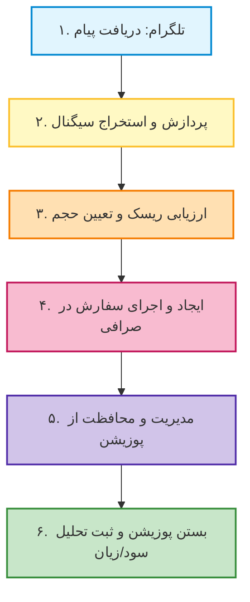
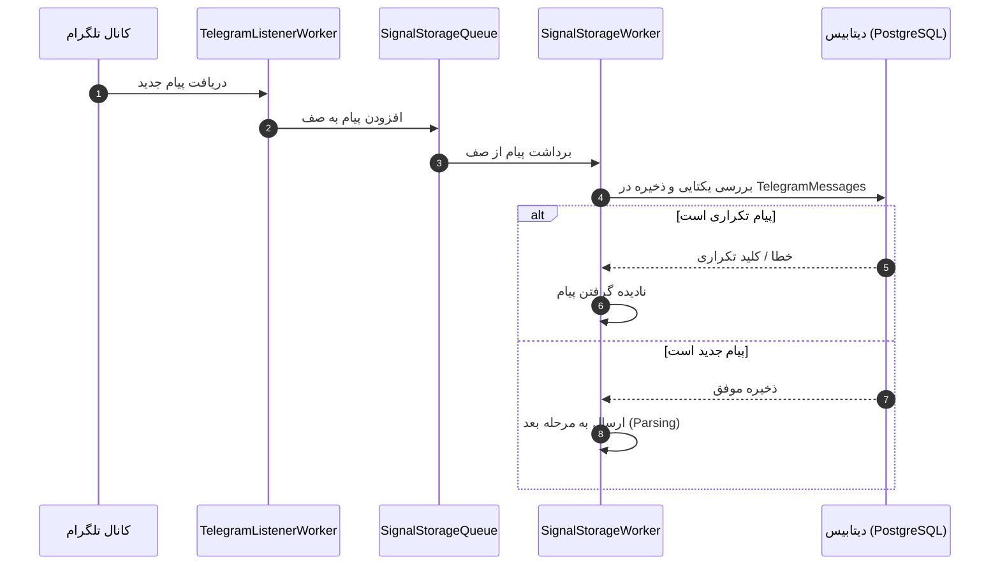
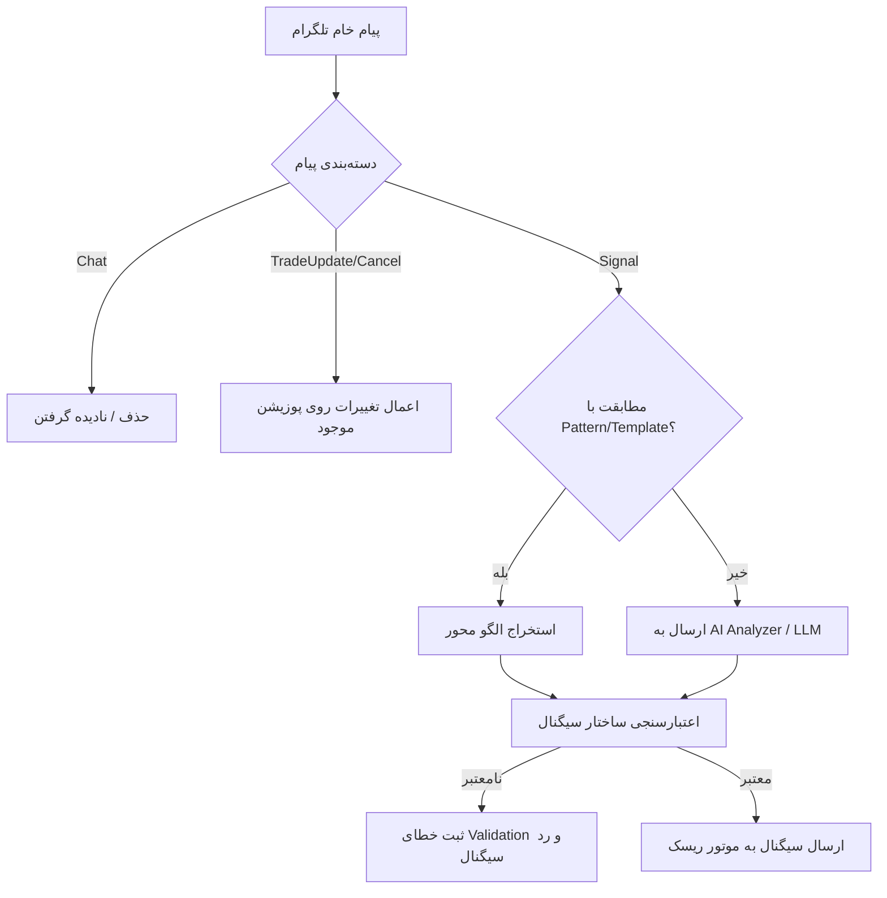
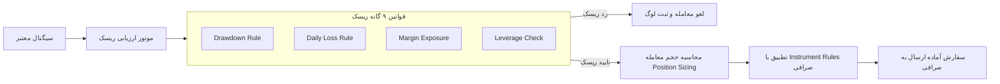
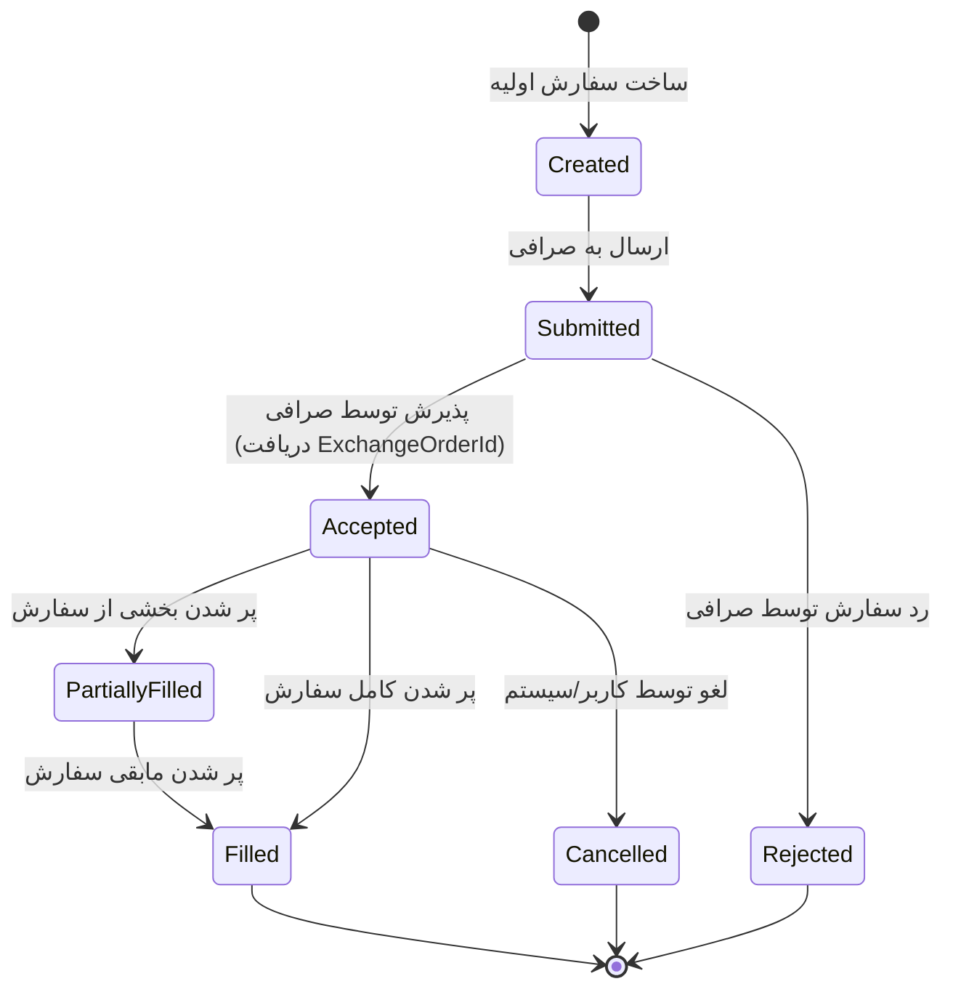
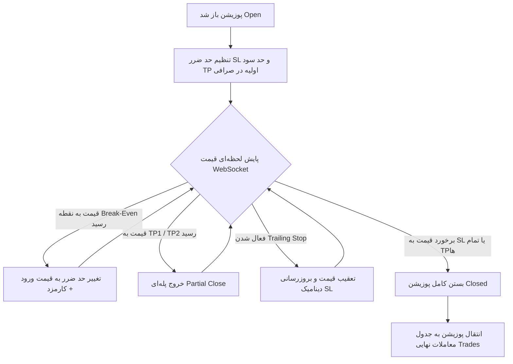
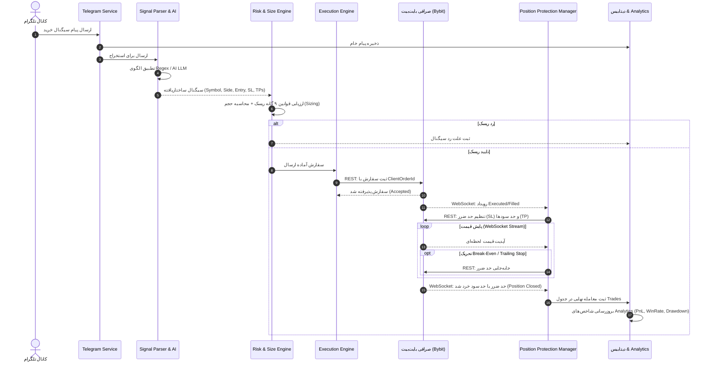

# راهنمای کامل و بصری روند ترید (Trading Process Engine)

این مستند به طور کامل و تصویری، روند معامله‌گری خودکار (Trading Process) را در این سیستم شرح می‌دهد. تمام مراحل از زمان دریافت پیام در تلگرام تا تحلیل سود/زیان نهایی به همراه دیاگرام‌های **Mermaid** و توضیحات فنی دقیق آورده شده‌اند.

---

## ۱. نگاه کلی به معماری و جریان داده سیستم

سیستم از معماری Clean Architecture و Domain-Driven Design (DDD) پیروی می‌کند و جریان معاملات طی ۶ مرحله اصلی مدیریت می‌شود:

---

## ۲. مرحله اول: دریافت پیام از تلگرام (Telegram Ingestion)

1. **دریافت (Reception):** سرویس `TelegramListenerWorker` از طریق کتابخانه `WTelegramClient` پیام‌های کانال‌های تحت نظر را دریافت می‌کند.
2. **صف‌بندی (Queueing):** پیام‌ها درون صف ایمن thread-safe قرار می‌گیرند (`SignalStorageQueue`).
3. **ذخیره‌سازی و یکتاپذیری (Persistence & Deduplication):** سرویس `SignalStorageWorker` پیام را در دیتابیس (`TelegramMessages`) ذخیره می‌کند. در صورتی که پیام تکراری باشد (ترکیب `ChannelId` + `MessageId`)، به وسیله کلید یکتا (Unique Index) دیتابیس رد می‌شود.

---

## ۳. مرحله دوم: پردازش، دسته‌بندی و استخراج سیگنال (Message Parsing)

در این مرحله پیام خام پردازش می‌شود:

1. **دسته‌بندی (Classification):** کلاس `MessageClassifier` بر اساس واژگان کلیدی انگلیسی و فارسی پیام را در یکی از گروه‌های زیر قرار می‌دهد:
   - `Signal` (سیگنال جدید)
   - `TradeUpdate` (به‌روزرسانی معامله مانند تغییر حد ضرر)
   - `Cancel` (لغو سیگنال)
   - `Chat` (چت معمولی - نادیده گرفته می‌شود)
2. **استخراج الگو محور (Template Mode):** پیام با الگوهای Regex ذخیره شده در دیتابیس مقایسه می‌شود.
3. **استخراج با هوش مصنوعی (AI Fallback Mode):** اگر الگویی منطبق نشود، پیام به ماژول AI (`AIAnalyzer`) ارسال شده تا پارامترهای سیگنال با خروجی ساختاریافته JSON استخراج شوند.
4. **اعتبارسنجی اولیه (Validation):** سرویس `SignalValidationService` پر بودن نماد (Symbol)، جهت معامله (Buy/Sell)، نقطه ورود (Entry)، حد ضرر (SL) و اهداف سود (TP) را بررسی می‌کند.

---

## ۴. مرحله سوم: مدیریت ریسک و تعیین حجم (Risk Engine & Sizing)

قبل از ارسال هر سفارشی به صرافی، سیگنال باید از ۹ قانون ریسک (Risk Rules) بگذرد:

1. **ارزیابی قوانین ریسک (Risk Rule Evaluation):**
   - بررسی حداکثر افت سرمایه (Max Drawdown)
   - حداکثر حد ضرر روزانه (Max Daily Loss)
   - حداکثر ریسک در هر معامله (Risk Per Trade)
   - حداکثر مارجین درگیر (Max Margin Exposure)
   - حداکثر لوریج مجاز (Max Leverage)
   - و سایر قوانین حفاظتی
2. **تعیین حجم معامله (Position Sizing):** محاسبه دقیق میزان حجم (Quantity) بر اساس درصد ریسک حساب، فاصله نقطه ورود تا حد ضرر و اهرم (Leverage).
3. **اعتبارسنجی قوانین صرافی (Instrument Rules):** تطبیق حجم و قیمت با قوانین صرافی (حداقل/حداکثر حجم، Step Size، Tick Size و Min Notional Value).

---

## ۵. مرحله چهارم: اجرای سفارش در صرافی (Order Execution Engine)

سفارش تایید شده توسط موتور ریسک، وارد ماشین حالت سفارش (Order State Machine) می‌شود:

1. **شناسه یکتا (ClientOrderId):** یک شناسه یکتای یکتاپذیر (Idempotent) با فرمت `TB-{Guid}` ایجاد می‌شود.
2. **امضای درخواست (HMAC-SHA256):** درخواست به صورت امن امضا شده و به API V5 صرافی بايبیت (Bybit) ارسال می‌گردد.
3. **تغییرات حالت سفارش (Order Status Machine):**

---

## ۶. مرحله پنجم: مدیریت و محافظت از پوزیشن (Position Lifecycle & Protection)

پس از پر شدن سفارش (`Filled`)، پوزیشن در حالت `Open` قرار می‌گیرد. در این مرحله سیستم به صورت لحظه‌ای از طریق **WebSocket** و **REST Sync** پوزیشن را مدیریت می‌کند:

### قابلیت‌های پیشرفته محافظت از پوزیشن:
* **نقطه سر به سر (Break-Even):** وقتی قیمت به تارگت مشخصی برسد، حد ضرر به قیمت ورود (به همراه جبران کارمزد) منتقل می‌شود تا ریسک معامله صفر شود.
* **اهداف چندگانه سود (Multi-TP):** با رسیدن قیمت به هر تارگت، درصدی از حجم معامله نقد شده و حد ضرر تارگت‌های بعدی جابه‌جا می‌شود.
* **حد ضرر متحرک (Trailing Stop):** حد ضرر با فاصله ثابت یا درصدی، به دنبال قیمت حرکت می‌کند تا بیشترین سود ممکن حفظ شود.
* **همگام‌سازی خودکار (Self-Healing Loop):** سرویس‌های پس‌زمینه با صرافی همگام می‌شوند تا در صورت قطعی اینترنت یا وب‌سوکت، وضعیت پوزیشن‌ها دائماً بازیابی و اصلاح شود.

---

## ۷. مرحله ششم: ثبت معامله و تحلیل عملکرد (Analytics & Reporting)

پس از بسته شدن پوزیشن، اطلاعات معامله در جدول `Trades` ثبت شده و شاخص‌های آماری محاسبه می‌شوند:

```mermaid
gantt
    title نمونه چرخه زمانی یک معامله (Trade Timeline)
    dateFormat  HH:mm
    axisFormat %H:%M

    دریافت پیام تلگرام       :a1, 10:00, 1m
    پردازش و ریسک           :a2, after a1, 1m
    ارسال سفارش به صرافی    :a3, after a2, 1m
    پوزیشن باز (Open)       :a4, after a3, 15m
    تریلینگ استاپ & BE      :a5, after a4, 20m
    بسته شدن پوزیشن (Closed):a6, after a5, 1m
    ثبت در Analytics        :a7, after a6, 1m
```

### شاخص‌های محاسباتی در بخش Analytics:
* **PnL خالص و ناخالص (Gross & Net Realized PnL)**
* **نرخ برد (Win Rate %)**
* **ضریب سودآوری (Profit Factor)**
* **منحنی افت سرمایه (Drawdown Curve)**
* **میانگین زمان باز بودن معاملات (Average Duration)**

---

## ۸. دیاگرام جامع و کامل چرخه معامله (End-to-End Sequence Diagram)

دیاگرام زیر تمامی اجزای سیستم را در یک نگاه نشان می‌دهد:

---
*این مستند مطابق با آخرین کد و معماری پیاده‌سازی شده در پروژه Trading Bot آماده شده است.*
